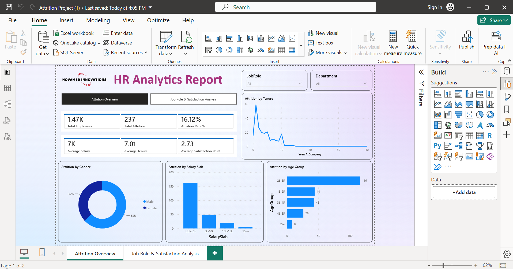
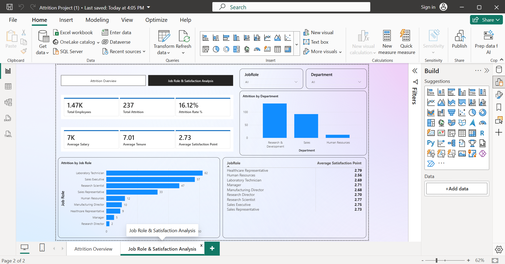

# 👨‍💼 HR Analytics Dashboard


---

## 📌 Project Overview

Developed an interactive HR Analytics Dashboard in Microsoft Power BI to analyze workforce metrics, employee attrition, department performance, and workforce demographics. The dashboard provides actionable insights to support HR teams in improving employee retention, workforce planning, and overall organizational performance.

---

## 🎯 Project Objectives

- Monitor employee attrition trends
- Analyze workforce demographics
- Evaluate department-wise performance
- Track employee satisfaction and retention
- Support HR decision-making through interactive dashboards

---

## 🛠 Technologies Used

- Microsoft Power BI
- Power Query
- DAX
- Data Modeling
- Data Visualization

---

## 📊 Dashboard Features

### Dashboard 1 – Workforce Overview

- Employee Overview
- Department-wise Analysis
- Gender Distribution
- Education Analysis
- Job Role Distribution
- Interactive KPI Cards

### Dashboard 2 – Attrition & Performance

- Employee Attrition Analysis
- Age Group Analysis
- Salary Distribution
- Years at Company
- Job Satisfaction Analysis
- Interactive Filters & Slicers
---

## 📷 Dashboard Preview

### Dashboard 1 – Workforce Overview



---

### Dashboard 2 – Attrition & Performance Analysis


---

## 📈 Key Performance Indicators (KPIs)

- Total Employees
- Active Employees
- Attrition Count
- Attrition Rate
- Average Age
- Average Salary
- Department-wise Attrition
- Job Role Distribution
- Employee Satisfaction

---

## 💡 Business Insights

- Identified departments with the highest employee attrition.
- Analyzed workforce demographics across age, gender, and education.
- Compared attrition rates by job role and department.
- Enabled HR teams to monitor workforce trends using interactive dashboards.

---

## 📂 Folder Structure

```text
10-PowerBI-HR-Analytics
│
├── README.md
├── LICENSE
│
├── Dashboard
│   └── HR_Analytics_Dashboard.pbix
│
├── Dataset
│   └── HR_Analytics_Data.xlsx
│
└── Images
│   └── Dashboard.png
```

---

## 🚀 Future Improvements

- Add predictive attrition analysis using machine learning.
- Integrate live HR data sources.
- Include employee performance metrics.
- Develop drill-through reports for detailed workforce analysis.

---

## 👨‍💻 Author

**Shivam Choudhry**
